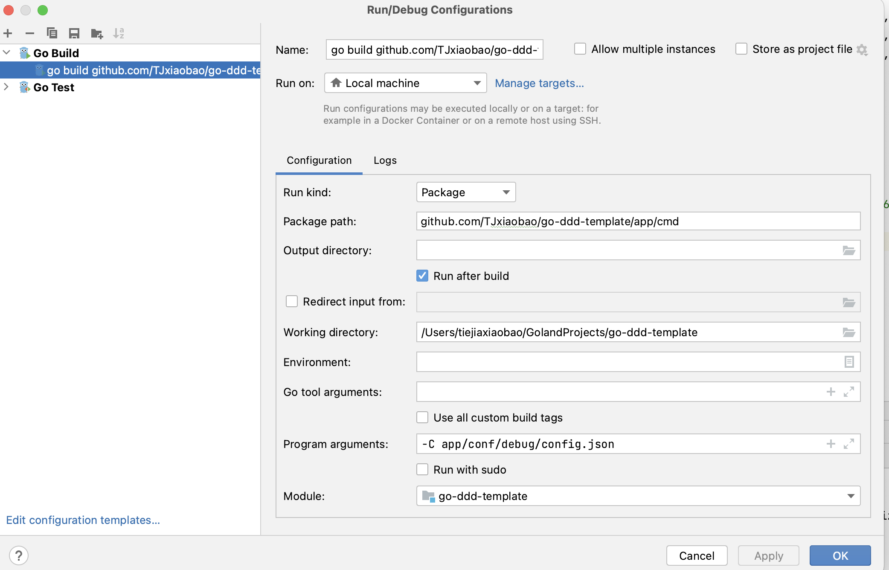
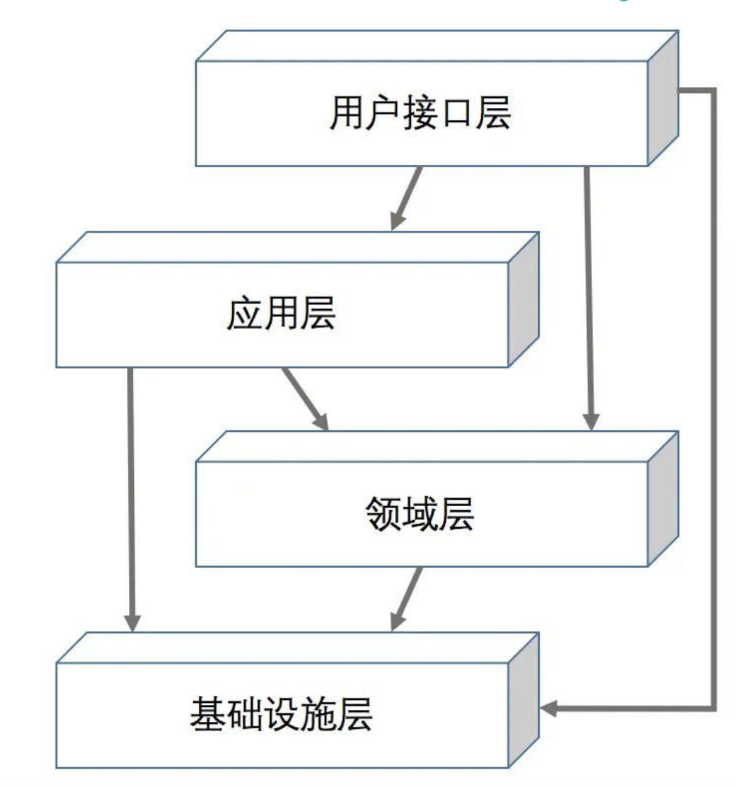

# go-ddd-template

## 1、Introduction

Use the DDD domain model to realize the Web development function of the go language. It is ready to use out of the box, just pull the code and change the project name to use it. It can be put into production with confidence (this template has production precedents).


## 2、Target

Realize the simplification of DDD development difficulty, so that developers can directly carry out business development without caring about technical details and implementation. Realize the separation of technology and business, improve development efficiency and quality. You only need to configure the relevant configuration files and design the business domain model. The relevant business code can be generated.

At present, the business can only be implemented by pulling codes and writing relevant codes, and then it will gradually develop into automatic generation of ddd codes.

Of course, it is also the first version of go-ddd-template: v1.0.0;

## 3、Startup project

**1. First, you need to configure related service components such as mysql and redis in the `conf` directory:**

```json
{
  "app": {
    "name": "go-ddd-template",
    "env": "pre",
    "port": 8001,
    "debug_port": 18001
  },
  "logger": {
    "log_level": "debug",
    "max_backups": 3,
    "max_size": 100
  },
  "mysql_rw": {
    "host": "localhost",
    "port": 3306,
    "user": "root",
    "password": "123",
    "db": "test",
    "charset": "utf8mb4",
    "max_open_count": 32,
    "max_idle_count": 32,
    "log": {
      "path": "",
      "max_backups": 3,
      "max_size": 100
    }
  },
  "redis": {
    "host": "localhost",
    "port": 6379,
    "auth": "123",
    "pool_size": 128
  }
}
```

Then you can start the project with the command in the terminal:

```ssh
go run app/cmd/main.go -C app/conf/debug/config.json
```

**⚠️Note: The configuration file under the `conf/debug` directory is started here. If you want to start other configuration files, you only need to specify the relevant file path.。**

Or you can configure the project parameters here, and then start `main` directly：




## 


## 4、Hierarchy




**1、user interface layer**

This layer is mainly responsible for directly facing external users or systems, receiving external input, and returning results.

The user interface layer is a relatively light layer that does not contain business logic. You can do some simple input parameter verification, and you can also record access logs to handle exceptions uniformly. At the same time, the encapsulation of the return value should also be done at this layer.

**2、application layer**

The application layer is usually the direct consumer of the user interface layer.

However, the real business rules are not implemented in the application layer, but the capabilities provided by the domain layer are coordinated and called according to the actual use case. In other words, the application layer mainly does orchestration work.

In addition, the application layer is also responsible for the more important function of transactions.

**3、domain layer**

The domain layer is the core layer of the entire business.

We generally use hyperemia models to model actual objects.

At the same time, because the core value of the business lies in its mode of operation, rather than specific technical means or implementation methods. Therefore, the coding of the domain layer is not allowed to depend on other external objects.

**4、infrastructure layer**

The infrastructure layer is a technically specific implementation detail that provides common technical capabilities for the upper layers.

For example, what kind of database we use, how the data is stored, whether we use cache, message queue, etc., are all implemented at this layer.

**5、code organization**

```
app/
    |- biz 							# Services
    |		|- adapter				# Adapter layer, exposes API service interfaces
    |   | 	|- http  			    # Exposes HTTP interfaces
    |		|		|- rpc 			# Exposes RPC interfaces
    |		|- application   		# Application layer
    |   |   |- app					# Orchestrates business logic without implementing logic
    |   |   |- cqe					# Definition and validation of input parameters
    |   |   |- dto					# Output data transfer objects
    |		|- domain   			# Domain layer
    |   |   |- entity				# Entity definitions
    |   |   |- repo					# Repository layer (isolates infrastructure layer for anti-corruption)
    |   |   |- service			    # Service layer to implement non-cohesive business logic
    |   |   |- vo					# Value objects, can encapsulate some business logic
    |		|- infrastructure       # Infrastructure layer
    |   |   |- convertor		    # Converts objects between domain layer and infrastructure layers
    |   |   |- dao					# DAO layer for CRUD operations on data, should not be coupled with business logic
    |   |   |		|- po			# Corresponds to data table structures
    |   |   |- persistence	        # Repository layer for anti-corruption
    |   |   |- httpclient		    # Used for calling other HTTP service API interfaces
    |   |   |- rpcclient		    # Used for calling other RPC service API interfaces
    |- internal/
    |   |- init/					# Initialization of services in biz
    |   |- resource					# Resource initialization		
    |
    |- cmd/                         # Entry and startup related code
    |- pkg/                         # Shared libraries and utilities
    |-  |- assert					# Assertion utilities
    |-  |- cache					# Basic cache methods
    |-  |- config					# Configuration utilities
    |-  |- error					# Global error definitions
    |-  |- iputil					# IP utilities
    |-  |- encode					# Encoding utilities
    |-  |- logger					# Logging utilities
	|-  |- manager					# Route handling plugins
	|-  |- middleware				# Middleware
	|-  |- restapi					# REST API definitions
	|-  |- version					# Version utilities
	|-  |- repository				# Repositories
    |- go.mod                       # Dependency management
    |- README.md                    # Project documentation
```


This project can basically improve 80% of the tool requirements in the industry. If there is a better implementation tool, welcome 👏 to contribute 🎉！

**If this project is helpful to you, please give it a star 🌟🌟🌟!**


## 推荐文章

[阿里技术专家详解 DDD 系列- Domain Primitive](https://mp.weixin.qq.com/s?__biz=MzAxNDEwNjk5OQ==&mid=2650403892&idx=1&sn=a91fa477392e80f9420a8ca4d26bcace&chksm=83953c2cb4e2b53a6af3b5a82c3b7d7ed932bfe83f59877a935445ae89edd0ff4ee1c4e82fba&scene=21#wechat_redirect)

[深入理解聚合](http://noddd.cn/posts/10b4b980-d4e9-11eb-8739-c101f88c7d5c/)