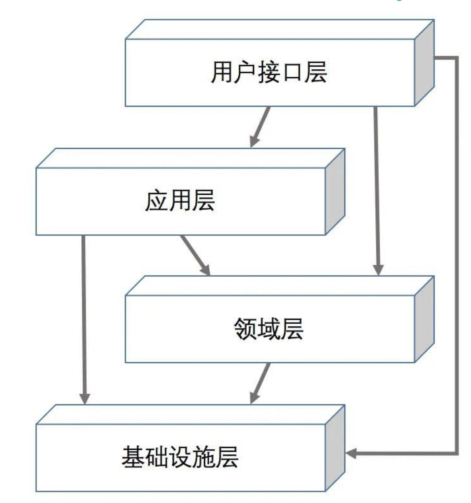

# go-ddd-template

## 1、简介

采用DDD领域模型实现 go 语言的 Web开发功能。主打开箱即用，拉取代码更改项目名即可使用。可放心投入生产使用（本模版已有生产先例）。


## 2、目标

实现简化DDD开发难度，使开发人员可直接进行业务开发，不需关心技术细节与实现。实现技术与业务分离，提升开发效率与质量。只需要通过配置相关配置文件和设计业务领域模型即可。即可生成相关业务代码。

目前只能通过拉取代码自己编写相关代码来进行业务实现，随后会逐渐发展成为自动生成ddd代码。

当然现在也是 go-ddd-template 的第一版：v1.0.0;

## 3、启动项目

**1、首先需要在 `conf` 目录下配置相关的mysql和redis等服务组件：**

```json
{
  "app": {
    "name": "go-ddd-template",
    "env": "pre",
    "port": 8001,
    "debug_port": 18001
  },
  "logger": {
    "log_level": "debug",
    "max_backups": 3,
    "max_size": 100
  },
  "mysql_rw": {
    "host": "localhost",
    "port": 3306,
    "user": "root",
    "password": "123",
    "db": "test",
    "charset": "utf8mb4",
    "max_open_count": 32,
    "max_idle_count": 32,
    "log": {
      "path": "",
      "max_backups": 3,
      "max_size": 100
    }
  },
  "redis": {
    "host": "localhost",
    "port": 6379,
    "auth": "123",
    "pool_size": 128
  }
}
```

然后可以在终端通过命令启动项目：

```ssh
go run app/cmd/main.go -C app/conf/debug/config.json
```

**⚠️注意：这里启动的是 `conf/debug` 目录下面的配置文件嗷，如果想启动其他配置文件可以只需要制定相关文件路径即可。**

或者可以在这个地方配置好项目参数，然后直接启动 `main` 即可：


## 


## 4、层级划分




**1、用户接口层**

这一层主要负责直接面向外部用户或者系统，接收外部输入，并返回结果。

用户接口层是比较轻的一层，不含业务逻辑。可以做一些简单的入参校验，也可以记录一下访问日志，对异常进行统一的处理。同时，对返回值的封装也应当在这层完成。

**2、应用层**

应用层通常是用户接口层的直接使用者。

但是在应用层中并不实现真正的业务规则，而是根据实际的 use case 来协调调用领域层提供的能力。也即，应用层主要做的是编排工作。

另外，应用层还负责了事务这个比较重要的功能。

**3、领域层**

领域层是整个业务的核心层。

我们一般会使用充血模型来建模实际的对象。

同时，由于业务的核心价值在于其运作模式，而不是具体的技术手段或实现方式。因此，领域层的编码是不允许依赖其他外部对象的。

**4、基础设施层**

基础设施层是在技术上具体的实现细节，它为上面各层提供通用的技术能力。

比如我们使用了哪种数据库，数据是怎么存储的，有没有用到缓存、消息队列等，都是在这一层要实现的。

**5、代码的组织形式**

```
app/
    |- biz 							# 服务
    |		|- adapter				# 适配层，暴露相关api服务接口
    |   | 	|- http  			    # 暴露http接口
    |		|		|- rpc 			# 暴露rpc接口
    |		|- application   		# 应用层
    |   |   |- app					# 负责编排业务逻辑，并不实现逻辑 
    |   |   |- cqe					# 入参的定义和校验
    |   |   |- dto					# 出参结构
    |		|- domain   			# 领域层
    |   |   |- entity				# 实体定义
    |   |   |- repo					# 仓库层（用于隔离基础设施层，用于防腐）
    |   |   |- service			    # 服务层，用于实现无法内聚的业务
    |   |   |- vo					# 值对象，可内聚一些业务
    |		|- infrastructure       # 基础设施层
    |   |   |- convertor		    # 用于domian层和基础设施层之前对象的转换
    |   |   |- dao					# dao层，用于对数据的crud，不要和业务有关联！
    |   |   |		|- po			# 和对应于数据表中的结构
    |   |   |- persistence	        # 仓储层，用于防腐
    |   |   |- httpclient		    # 用于调用其他的http服务api接口
    |   |   |- rpcclient		    # 用于调用其他的rpc服务api接口
    |- internal/
    |   |- init/					# 初始化biz中的服务
    |   |- resource					# 初始化资源		
    |
    |- cmd/                         # 入口和启动相关
    |- pkg/                         #  可共享的库和工具
    |-  |- assert					# 断言工具
    |-  |- cache					# 缓存基础方法
    |-  |- config					# 配置工具
    |-  |- erron					# 全局erro定义
    |-  |- iputil					# ip工具
    |-  |- encode					# 编码工具
    |-  |- logger					# 日志工具
	|-  |- manager					# 路由处理插件
	|-  |- middleware				# 中间价
	|-  |- restapi					# restapi定义
	|-  |- version					# 版本工具
	|-  |- repository				# 仓储
    |- go.mod                       # 依赖管理
    |- README.md                    # 项目文档
```


本项目基本可以完善业界百分之80的工具需求，如果有更好的实现工具欢迎👏来贡献🎉嗷！

**如果本项目对您有所帮助那就来个star吧！**


## 推荐文章

[阿里技术专家详解 DDD 系列- Domain Primitive](https://mp.weixin.qq.com/s?__biz=MzAxNDEwNjk5OQ==&mid=2650403892&idx=1&sn=a91fa477392e80f9420a8ca4d26bcace&chksm=83953c2cb4e2b53a6af3b5a82c3b7d7ed932bfe83f59877a935445ae89edd0ff4ee1c4e82fba&scene=21#wechat_redirect)

[深入理解聚合](http://noddd.cn/posts/10b4b980-d4e9-11eb-8739-c101f88c7d5c/)